# Tazkartii REST API

## 📝 Table of Contents

- [Tazkartii REST API](#tazkartii)
  - [Table of Contents](#table-of-contents)
  - [Introduction](#introduction)
  - [Features](#features)
  - [🏁 Getting Started ](#getting-started)
    - [Prerequisite ](#prerequisite)
    - [Installation ](#installation)
    - [Running ](#running)
  - [💻 Built Using ](#built-using)
  - [📸 Demo Screens ](#demo-screens)
  - [📃 License ](#license)

## 📙 Introduction

Welcome to **Tazkartii** repository. This project aims to create an online automated ticket reservation system for football matches in the Egyptian Premier League. The system facilitates match management, ticket reservation, and stadium management for both administrators and fans.

## Features

- **Site Administrator**:
  - Approve new users with specific authorities.
  - Remove existing users.
- **EFA Managers**:
  - Create, edit, and manage match events.
  - Add new stadiums.
  - View match details and seat availability.
- **Customers (Fans)**:
  - Edit personal data.
  - View match details and vacant seats.
  - Reserve vacant seats for future matches.
  - Cancel reservations before the event.
- **Guests**:
  - Register a new account.
  - Sign in as an existing account.
  - View match details.

## 🏁 Getting Started <a name = "get-started"></a>

> This is an list of needed instructions to set up your project locally, to get a local copy up and running follow these
> instructuins.

### Prerequisite <a name = "req"></a>

1. Node.js
2. PostgreSQL

### Installation <a name = "Install"></a>

1. **_Clone the repository_**

```sh
$ git clone https://github.com/ZeyadTarekk/Tazkartii-REST-API
```

2. **_Navigate to Tazkartii Folder_**

```sh
$ cd Tazkartii-REST-API
```

### Running <a name = "running"></a>

**_Running program_**

1. **_Install modules_**

```sh
npm install
```

2. **_Create .env.development file and add your environment variables_**

- `DATABASE_HOST` Your PostgreSQL connection host like this `localhost`
- `DATABASE_NAME` The database name that you have created
- `DATABASE_USER` The user of the database like `postgres`
- `DATABASE_PASSWORD` The password of the database
- `DATABASE_PORT` The port of the database like `5432`
- `JWT_SECRET` any secret to use in JWT

3. **_Start program on development mode_**

```sh
npm start:dev
```

## 💻 Built Using <a name = "tech"></a>

- **NestJS**
- **PostgreSQL**

## 📸 Demo Screens <a name="screens"></a>

<div align="center">
  <h3 align="left">Login</h3>

  <h3 align="left">Signup</h3>
  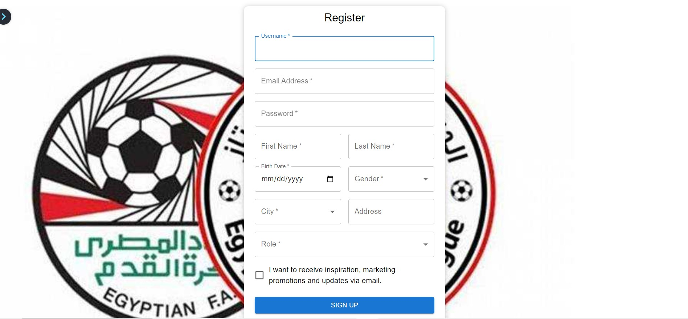
  <h3 align="left">Schedule Fixture</h3>
  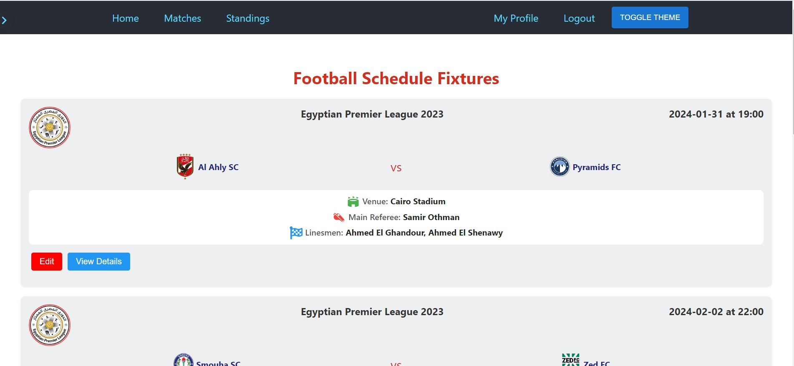
  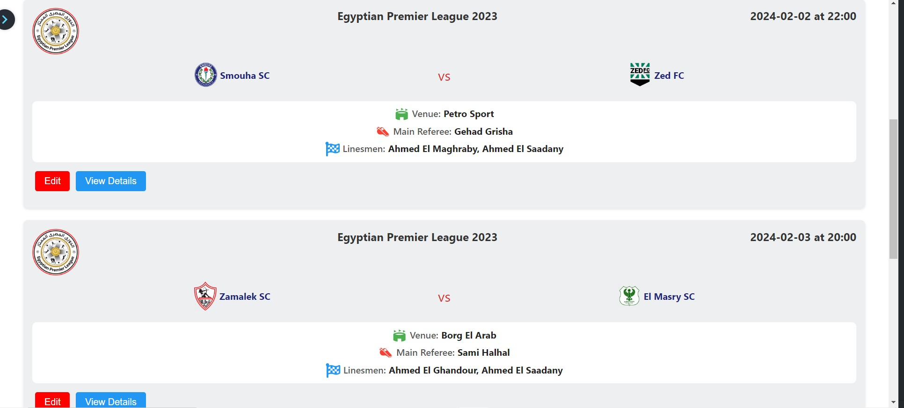

  <h3 align="left">Match details</h3>
  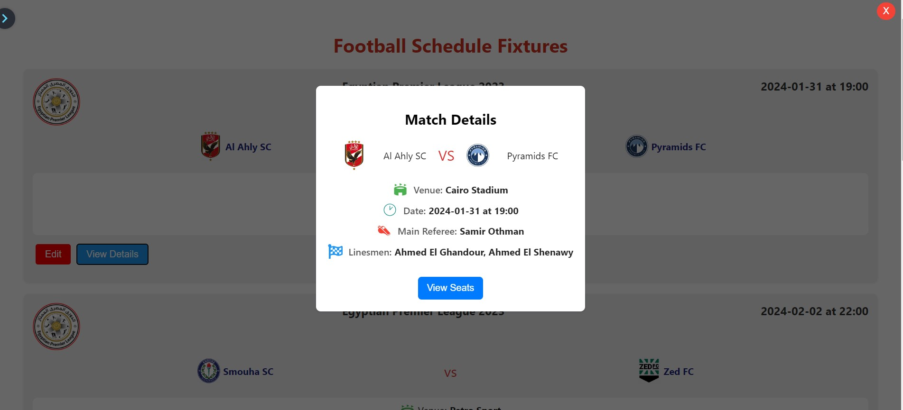
  <h3 align="left">Manager's profile</h3>
  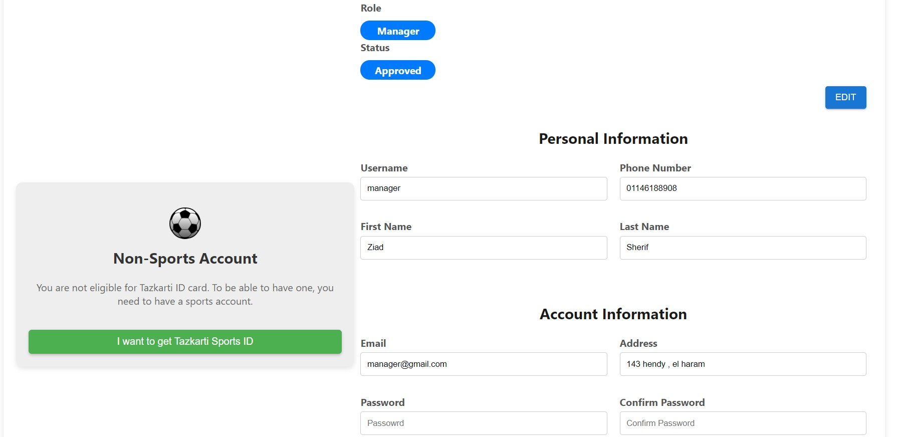
  <h3 align="left">League Standing</h3>
  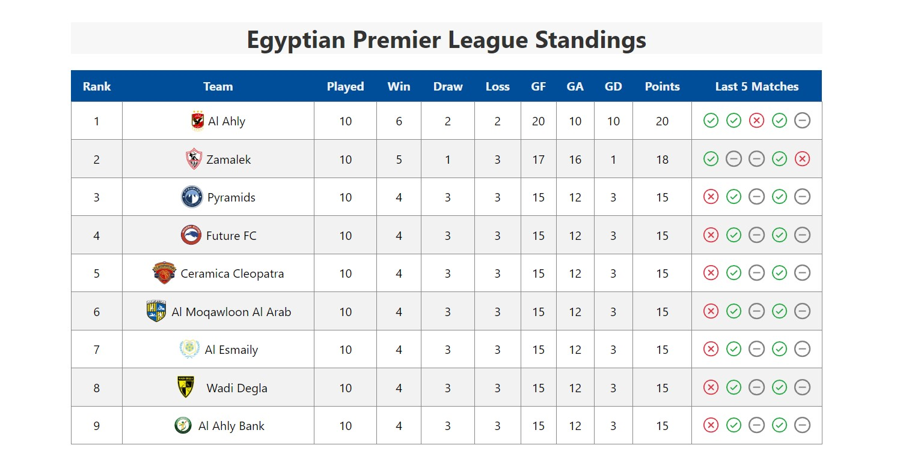
  <h3 align="left">Edit Match</h3>
  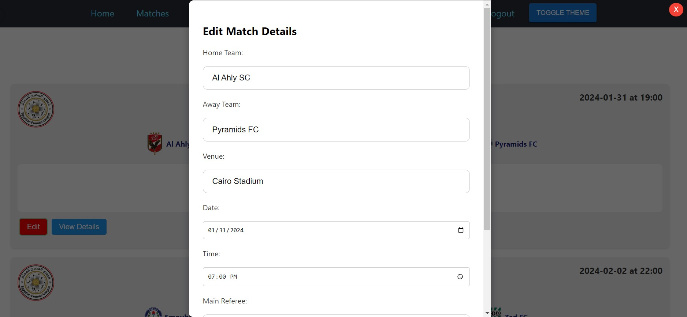
    <h3 align="left">Sidebar</h3>
  
  <h3 align="left">Match's seats</h3>
  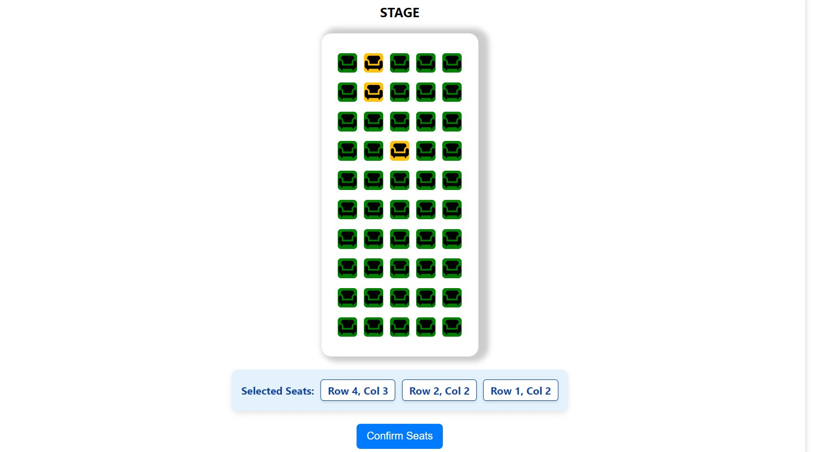
  <h3 align="left">Payment</h3>
  
  <h3 align="left">Tickets</h3>
  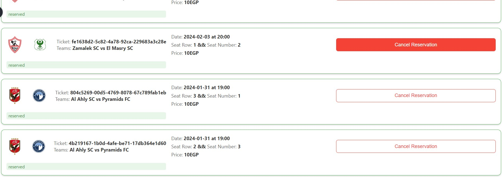
  <h3 align="left">Approved Users</h3>
  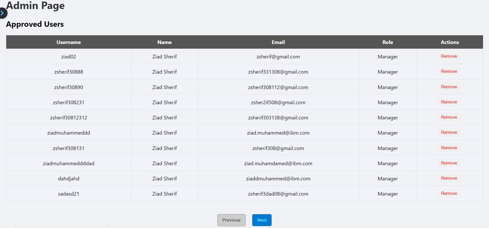
  <h3 align="left">Pending Users</h3>
  
  <h3 align="left">Responsivity</h3>
  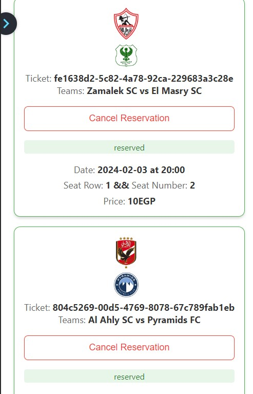
  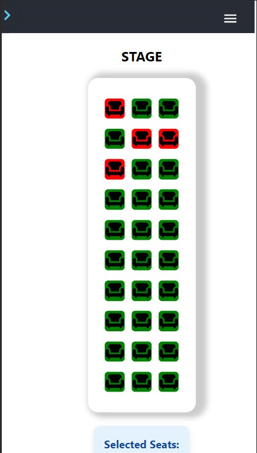
</div>

## 📃 License <a name = "license"></a>

> This software is licensed under MIT License, See [License](https://github.com/ZeyadTarekk/Tazkartii-REST-API/blob/main/LICENSE) for more information @Tazkartii.
